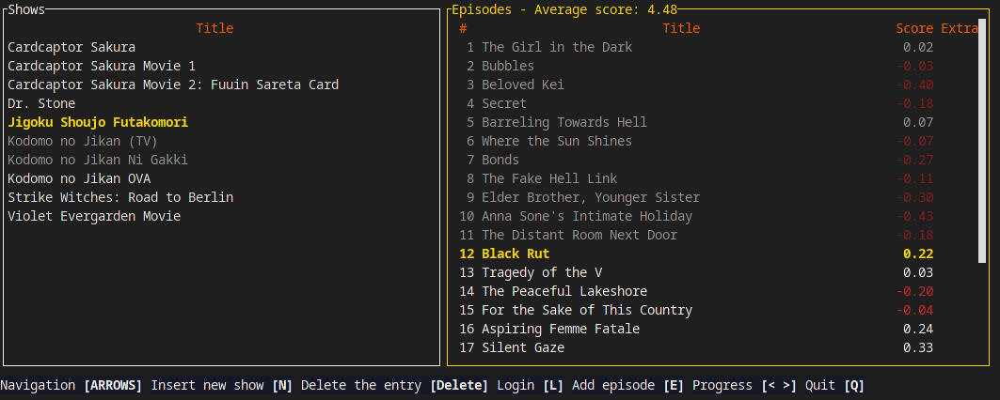

# lma
terminal-based show organizer (mainly anime) for locally stored episodes



#### What it does?
- Organizes shows stored on your drive and let's you start watching them
- Shows current progess, per episode scores and filler/recap status
- Links with an external service like MAL (can't be used without that)
- Automatically set stuff like start dates and completions on progress update

## Installation

### Precompiled
Grab an executable for your platform in [Releases](https://github.com/FakeMichau/lma/releases/latest) section under assets.
Currently Linux and Windows versions are being precompiled.

### Compilation
You need to have [rustup](https://rustup.rs/) installed.
```
cargo install --git https://github.com/FakeMichau/lma.git
```

### Linux packages
[lma](https://aur.archlinux.org/packages/lma) on AUR

## Usage
```
lma
```
For details and configuration check [docs](/docs/)

## Building
You need to have [rustup](https://rustup.rs/) installed. Clone the repo and: 

```
cargo build
```

## TODO
- Add more services like Kitsu and Anilist
- Make TUI independent from network requests to stop it from being blocked
- Add option to show more details about a show
- ###### learn more rust
